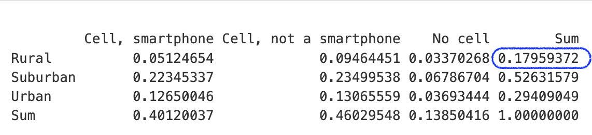
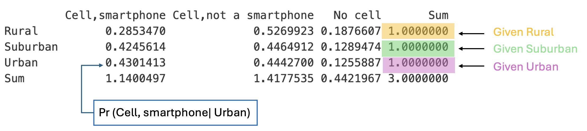
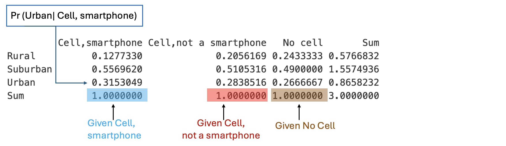
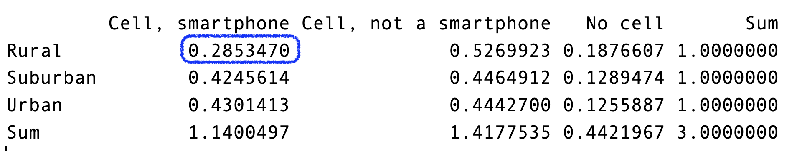

```{=html}
<!--
Show / hide answers to exercises.
Code adapted from: https://chrisbeeley.net/?p=1104
-->
```
```{=html}
<script>
function myFunction(id) {
    var x = document.getElementById(id);
    if (x.style.display === "none") {
        x.style.display = "block";
    } else {
        x.style.display = "none";
    }
}
</script>
```
```{=html}
<style>
div .info {
  margin: auto;
  background-color: #EAF0FB;
  width: 95%;
  padding: 10px;
}
</style>
```
```{r setup, include=FALSE}
# Smaller images for pdf
# knitr::opts_chunk$set(out.width="50%")
options(width=80)
```

<br>

Probability is the measure of the likelihood that an event will occur. It is a fundamental concept in mathematics and statistics, and it has many applications in various fields, including science, finance, and gaming.

<br>

# 1. Basic Concepts
<br>
**Experiment**: A process or action that leads to one or more possible outcomes.

**Sample Space**: The set of all possible outcomes of an experiment.

 **Event**: A subset of the sample space that represents the outcome(s) of interest.

Example: Tossing a coin is an experiment with two possible outcomes: heads or tails. 

* Sample space: {H, T}
* Event: {H}

<br>
**Your turn 1.1:** Write out the sample space and event for following experiments: 

1. Tossing a coin twice and getting at least one head.
2. Rolling a six-sided die and getting an odd number.
3. Drawing a card from a standard deck of 52 cards and getting a red card.

<button onclick="myFunction('q1')">

Show solution

</button>

::: {#q1 style="display:none"}
1. Tossing a coin twice:<br />
 * Sample Space: {HH, HT, TH, TT} 
 * Event: {HH, HT, TH}

2. Rolling a die:<br />
 * Sample Space: {1, 2, 3, 4, 5, 6} 
 * Event: {1, 3, 5} 

3. Drawing a card:<br />
 * Sample Space: 52 cards 
 * Event: 26 red cards 
:::

<!-- end solutions -->

<br>

# 2. Calculating Probability
<br>
Probability is the likelihood or chance of an event occurring. It is calculated by dividing the number of favorable outcomes by the total number of possible outcomes in the sample space.
<br>
<div style="border: 1px solid #ccc; padding: 10px; border-radius: 5px;">

$$
\textbf{Probability}= \frac{\text{Number of Favorable Outcomes}}{\text{Number of Possible Outcomes}}
$$

</div>
<br>
What is the probability of getting a head when tossing a fair coin?

$\text{Probability of getting a head} = \frac{1}{2} = 0.5$

<br>
**Your turn 2.1:** Calculate the probability of the following events:

1. Tossing a coin twice and getting at least one head.
2. Rolling a six-sided die and getting an odd number.
3. Drawing a card from a standard deck of 52 cards and getting a red card.

<button onclick="myFunction('q2')">
Show solution

</button>

::: {#q2 style="display:none"}
1. Tossing a coin twice:<br />
 * Probability = $\frac{3}{4} = 0.75$
 
2. Rolling a die:<br />
 * Probability = $\frac{3}{6} = 0.5$
 
3. Drawing a card:<br />
 * Probability = $\frac{26}{52} = 0.5$
 
:::

<!-- end solutions -->

<br>

# 3. Basic Properties of Probability
<br>
There are three basic properties of probability that are essential to understand:

1. **Probability is always between 0 and 1**: $0 \leq P(A) \leq 1$ <br />
2. **The sum of the probabilities of all possible outcomes is 1**: $P(S) = 1$ <br />
3. **The probability of the complement of an event is 1 minus the probability of the event**: $P(A^c) = 1 - P(A)$ <br />
<br>

# 4. Conditional Probability
<br>
Conditional probability is the probability of an event occurring given that another event has already occurred. It is denoted by $P(A|B)$, which reads as "the probability of event A given event B."
<br>

<div style="border: 1px solid #ccc; padding: 10px; border-radius: 5px;">

$$
Pr(A|B)= \frac{\text{Number of Favorable Outcomes for A and B}}{\text{Number of Favorable Outcomes for B}}
$$

</div>

<br>
**Example**: What is the probability of getting a head on the second toss given that the first toss was a head?

* Sample Space for tossing a coin twice: {HH, HT, TH, TT}
* Sample Space for the first toss being a head: {HH, HT}
* Event of getting a head on the second toss given the first toss was a head: {HH}

$\text{Probability of getting a head on the second toss given the first toss was a head} = \frac{1}{2} = 0.5$

<br>

**Your turn 4.1:** Calculate the conditional probability of the following events:
  
1. Rolling a six-sided die and getting an odd number given that the number rolled is less than 4.
2. Tossing a coin twice and getting at least one head given that the first toss was a head.
3. Drawing a card from a standard deck of 52 cards and getting a king given that the card drawn is a red.


<button onclick="myFunction('q4')">

Show solution

</button>

::: {#q4 style="display:none"}

1. Rolling a die:<br />
 * Sample Space for rolling a die: {1, 2, 3, 4, 5, 6}
 * Sample Space for the number rolled being less than 4: {1, 2, 3}
 * Event of getting an odd number given the number rolled is less than 4: {1, 3}
 * Probability = $\frac{2}{3} \approx 0.67$
 
2. Tossing a coin twice:<br />
 * Sample Space for tossing a coin twice: {HH, HT, TH, TT}
 * Sample Space for the first toss being a head: {HH, HT}
 * Event of getting at least one head given the first toss was a head: {HH, HT}
 * Probability = $\frac{2}{2} = 1$
 
3. Drawing a card:<br />
 * Sample Space for drawing a card: 52 cards
 * Sample Space for the card drawn being red: 26 red cards
 * Event of getting a king given the card drawn is red: 2 red kings
 * Probability = $\frac{2}{26} \approx 0.08$
 
:::

<!-- end solutions -->

<br>

# 5. Mobile Phone Survey Data

The following packages will be required or may come in handy.
```{r warning=FALSE, message=FALSE}
library(tidyverse) # For pipe operator 
```

## Data and Variables:

The [Mobilephone.csv](https://astral-theory-157510.appspot.com/secured/data/Mobilephone.csv) data are from a [2012 Pew Research Centre Survey](http://www.pewinternet.org/files/old- media/Files/Questionnaire/2012/PIP_Just_In_Time_topline.pdf) in the US. The survey asked 2254 respondents numerous questions about their demographics, internet activity and the ways in which they access the internet, including what type of mobile phone they use. We will explore how a user’s residential area (rural, suburban and urban) relates to the probability of owning a smartphone.

The dataset contains 126 variables. There are only two variables we need to consider for this class exercise: **usr** and **SmartPhone** . Coding Information:

**usr**: Residential location of user. Three levels: <span style="color: blue;"> R: Rural, S: Suburban or U: Urban</span>

Smartphone: Did a respondent own a smartphone? Three levels: <span style="color: blue;">1 = “Cell, smartphone”, 2 = “Cell, not a smartphone”,3 = “No cell”.</span>

Use this dataset to complete the following exercises.

**Your turn 5.1:** Load the data and display the first few rows.

<button onclick="myFunction('q5')">

Show solution

</button>

::: {#q5 style="display:none"}

```{r}
# Remember to set the correct path to the data file
#setwd(".../.../")

# Load the data
Mobilephone <- read.csv("data/Mobilephone.csv")
head(Mobilephone)
```

:::

<!-- end solutions -->


Since we are only interested in the variables **usr** and **SmartPhone**, we can create a subset of the data with only these two variables.

**Your turn 5.2:** Create a subset of the data with only the **usr** and **SmartPhone** variables.

<button onclick="myFunction('q6')">

Show solution

</button>

::: {#q6 style="display:none"}

```{r}

# Create a subset of the data with only the usr and SmartPhone variables

#option 1
Mobilephone_filter1 <- Mobilephone[,c('usr','SmartPhone')]
#option 2
Mobilephone_filter2 <- Mobilephone %>%
                            select(c('usr','SmartPhone'))
#option 3
Mobilephone_filter3 <- select(Mobilephone, usr,SmartPhone)

```

:::

<!-- end solutions -->

Next we will check if there are any missing values in the **usr** variable. If there are missing values, we will need to handle them before proceeding with the analysis.

```{r}
# Checking the number of missing values
Mobilephone_filter1$usr%>% is.na() %>%sum()
```

is.na() returns a logical vector indicating whether each element is missing or not. sum() is used to count the number of missing values. Since the output is 0, does it mean there are no missing values in the **usr** variable? Check if **usr** column has any values that are not R, S or U. (Hint: Use the unique() function)

**Your turn 5.3:** Check if the **usr** column has any values that are not R, S or U.

<button onclick="myFunction('q7')">

Show solution

</button>

::: {#q7 style="display:none"}

```{r}

# Check if the usr column has any values that are not R, S or U
unique(Mobilephone_filter1$usr)

```


:::

<!-- end solutions -->

Now that we have verified that there are blank values in the **usr** column, we will check the percentage of missing/blank values in the **usr** column.

```{r}
sum(Mobilephone_filter1$usr == ' ')/length(Mobilephone_filter1$usr)
```

As a rule of thumb, if you have less than 5% missing values, you can ignore it.
We will need to remove the blanks before proceeding with the analysis *(As a rule of thumb, if you have less than 5% missing values, you can ignore them)*. We can do this by creating a subset of the data that only includes the rows where the **usr** column contains only the values R, S, or U.

**Your turn 5.4:** Create a subset of the data that only includes the rows where the **usr** column is not blank and contains only the values R, S, or U.

<button onclick="myFunction('q8')">

Show solution

</button>

::: {#q8 style="display:none"}

```{r}

# Create a subset of the data that only includes the rows where the usr column is not blank

#option 1
Mobilephone_clean1 <- Mobilephone_filter1 %>% filter(usr != ' ')
#option 2
Mobilephone_clean2 <- Mobilephone_filter1 %>% filter(usr %in% c('S','R','U'))
#option 3
Mobilephone_clean3 <- Mobilephone_filter1[Mobilephone_filter1$usr != ' ',]
```

:::

<!-- end solutions -->

Now that we have cleaned the data, we can convert both the **usr** and **SmartPhone** variables to factors.

**Your turn 5.5:** Convert the **usr** and **SmartPhone** variables to factors.

<button onclick="myFunction('q9')">

Show solution

</button>

::: {#q9 style="display:none"}

```{r}

# Convert the usr and SmartPhone variables to factors
Mobilephone_clean1$usr <- Mobilephone_clean1$usr %>% 
                          factor(levels=c("R","S","U"),
                                 labels=c("Rural","Suburban","Urban"))

class(Mobilephone_clean1$usr)
levels(Mobilephone_clean1$usr)

Mobilephone_clean1$SmartPhone <- Mobilephone_clean1$SmartPhone %>% 
                                factor(levels=c(1,2,3),
                                        labels=c("Cell,smartphone","Cell,not a smartphone", 
                                                 "No cell"))

class(Mobilephone_clean1$SmartPhone)
levels(Mobilephone_clean1$SmartPhone)
```

:::

<!-- end solutions -->


Next run the following code to get a table of the counts of the **usr** and **SmartPhone** variables.

```{r}
# Create a table of the counts of the usr and SmartPhone variables

#option 1
table(Mobilephone_clean1$usr, Mobilephone_clean1$SmartPhone) %>% addmargins()

#option 2
xtabs(~usr + SmartPhone, data = Mobilephone_clean1) %>% addmargins()
```

## Probabilities.

We will convert these counts to percentages to find the probabilities of interest.

```{r}

# Convert the counts to percentages

table(Mobilephone_clean1$usr, Mobilephone_clean1$SmartPhone) %>% prop.table()%>% addmargins()

```

**Example**:What’s the probability a person was from a rural area?

#### Using the sample space and event definition

*Sample space: All individuals in the dataset (2254)

*Event: Individuals from rural areas (389)

*Probability = $\frac{389}{2254} \approx 0.17$

#### Using the proportion table



#### Using R code

```{r}
#Pr(Rural) =
sum(Mobilephone_clean1$usr=="Rural")/length(Mobilephone_clean1$usr)
    
    
``` 

**Your turn 5.6:** What’s the probability that a person owned a smartphone?

<button onclick="myFunction('q10')">

Show solution

</button>

::: {#q10 style="display:none"}

```{r}
#Pr(Smartphone) =
sum(Mobilephone_clean1$SmartPhone=="Cell,smartphone")/length(Mobilephone_clean1$SmartPhone)
```

:::

<!-- end solutions -->

**Your turn 5.7:** What’s the probability a person had a smartphone and lived in an urban area?

<button onclick="myFunction('q11')">

Show solution

</button>

::: {#q11 style="display:none"}

```{r}

#Pr(Smartphone and Urban) =

sum(Mobilephone_clean1$usr=="Urban" & Mobilephone_clean1$SmartPhone=="Cell,smartphone")/length(Mobilephone_clean1$usr)

```

:::

<!-- end solutions -->

**Your turn 5.8:** What’s the probability a person owned a mobile phone?

<button onclick="myFunction('q12')">

Show solution

</button>

::: {#q12 style="display:none"}

```{r}

#Pr(Mobilephone) = #Pr(Smartphone OR Cell)

#approach 1
    sum(Mobilephone_clean1$SmartPhone =="Cell,smartphone" |
          Mobilephone_clean1$SmartPhone =="Cell,not a smartphone")/length(Mobilephone_clean1$SmartPhone)
    
    sum(Mobilephone_clean1$SmartPhone != "No cell")/length(Mobilephone_clean1$SmartPhone)
    
#approach 2
# 1- Pr(No cell)
  1-(sum(Mobilephone_clean1$SmartPhone == "No cell")/length(Mobilephone_clean1$SmartPhone))
    
```

:::

<!-- end solutions -->

## Conditional probabilities.


#### Convert the counts to row proportions

```{r, results=FALSE}
table(Mobilephone_clean1$usr, Mobilephone_clean1$SmartPhone) %>% prop.table(margin=1)%>% addmargins()
```



#### Convert the counts to column proportions

```{r , results=FALSE}
table(Mobilephone_clean1$usr, Mobilephone_clean1$SmartPhone) %>% prop.table(margin=2)%>% addmargins()
  
```



**Example**:What’s the probability a person had a smartphone given they were from a rural area?

#### Using the sample space and event definition

*Sample space: All individuals in the dataset from rural areas (389)

*Event: Individuals from rural areas who owned a smartphone (111)

*Probability = $\frac{111}{389} \approx 0.29$

#### Using the row proportion table



#### Using R code

```{r}

#Pr(Smartphone|Rural) =
sum(Mobilephone_clean1$usr=="Rural" & Mobilephone_clean1$SmartPhone=="Cell,smartphone")/sum(Mobilephone_clean1$usr=="Rural")

```

**Your turn 5.9:** What’s the same probability, but for a person who lived in a suburban area?

<button onclick="myFunction('q13')">

Show solution

</button>

::: {#q13 style="display:none"}

```{r}

#Pr(Smartphone|Suburban) =

sum(Mobilephone_clean1$usr=="Suburban" & Mobilephone_clean1$SmartPhone=="Cell,smartphone")/sum(Mobilephone_clean1$usr=="Suburban")

```

:::

<!-- end solutions -->

**Your turn 5.10:** What’s the probability a person lived in an urban area given they owned a smartphone?

<button onclick="myFunction('q14')">

Show solution

</button>

::: {#q14 style="display:none"}

```{r}

#Pr(Urban|Smartphone) =

sum(Mobilephone_clean1$usr=="Urban" & Mobilephone_clean1$SmartPhone=="Cell,smartphone")/sum(Mobilephone_clean1$SmartPhone=="Cell,smartphone")

```

:::

<!-- end solutions -->

## Visualising the data

We will next visualise the smartphone ownership within each area of residence.

```{r}

table_1 <- table(Mobilephone_clean1$SmartPhone,Mobilephone_clean1$usr) %>% 
  prop.table(margin = 2)
table_1 %>% barplot(main = "Smartphone Ownership by Region", 
                    ylab="Proportion within Region",
                    ylim=c(0,.8), 
                    legend=rownames(table_1), beside=TRUE,
                    args.legend=c(x = "top", horiz=TRUE, 
                                  title="Smartphone Ownership"),
                    xlab="Region")
grid()
```

#### Using ggplot2

```{r}
df <- as.data.frame(table_1)
colnames(df) <- c('SmartPhone','usr','Prop')

# plot grid and mapping
ggplot(df, aes(fill=SmartPhone, y=Prop, x=usr))+ 
  geom_bar(position="dodge", stat="identity") + 
  labs(title = 'Smartphone Ownership by Region',
       y = 'Proportion within Region',
       x = 'Region', fill='Smartphone Ownership')
```

**Your turn 5.11:** What do you observe from the bar plot?

<button onclick="myFunction('q15')">

Show solution

</button>

::: {#q15 style="display:none"}

From the bar plot, we can see that the proportion of smartphone ownership is highest in urban areas, followed by suburban areas and rural areas. This suggests that there is a relationship between the area of residence and smartphone ownership. 

:::

<!-- end solutions -->

